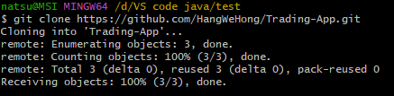
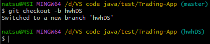
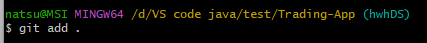
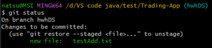
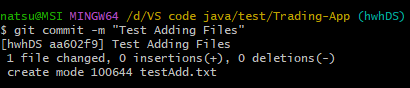
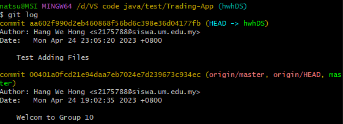
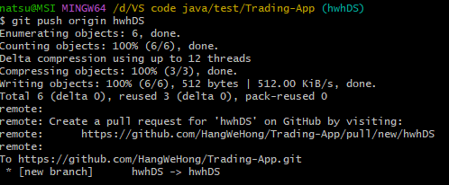
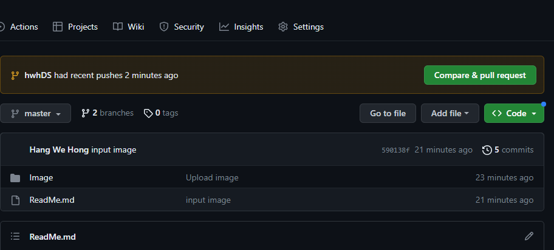
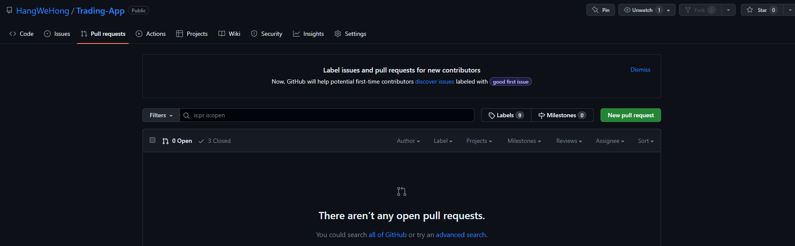

# Group10

This is a repository of Data Structure Assignment for Group 10 students ❤❤<br>
<br>
!!(Kindly access the "TradingApp" folders to view previews and demonstrations of the trading app.)

```java
public class Teamwork {
    public static void main(String[] args) {
        System.out.println("Teamwork makes the dream works");
    }
}
```

## How to use

For those who are unfamilliar with github,you might wanna try to watch this [tutorial video](https://www.youtube.com/watch?v=RGOj5yH7evk) ,and u can make the playback speed x2 so this video will only take about half an hour for you to learn all the git commands and basic knowledge!(can skip the ssh part tho cuz we'll just use the https) Gamabateh!! But anyway i will still put some steps for those who are still new with git to follow.

## Add your files
Before doing anything ,make sure you downloaded [git](https://www.atlassian.com/git/tutorials/install-git?section=git-for-mac-installer)

You can add your files by:

- Create or upload files using github
- Add files using the command line when you have learned all the [git commands](https://gist.github.com/gwenf/19e5748a5391929e8e938a22c8a4b3f2),only a few lah easy peesy


## Git Tutorial

### Setup

You can clone this project by running the following command:

```shell
git clone https://github.com/HangWeHong/Trading-App.git
```



Then, checkout to a new branch using(i wanted to say any branch name but to be easier to identify who did what , lets all put our name as the branch name,for me maybe i'll put hwhDS):

```shell
git checkout -b <branch-name>
```

As an example,




### Add files

```shell
git add <the name of the files u wanted to add or simply . which means all>/*
```



For this example, I have added one file `testAdd.txt` .

To verify that the files are added successfully, you may use the command:

```shell
git status
```



### Commit (Save) files

You can then commit the files using:

```shell
git commit -m "<commit-message>"
```



To verify that you made a commit, you may use the Git log to check the commit history:

```shell
git log
```



Note: use the `q` key to quit from commit history.

### Push (Upload) commits

Now you can push your changes to GitHub by:

```shell
git push origin <branch-name>
```



You should be able to view your pushed branch in the GitHub repository now.




### Create pull/merge request

Obviously, click the `Compare & Pull Request`. In the next page, press the `Create Pull Request` button again.

**If it does not show any pop up like the image above,you can simply go to `Pull requests` ,then `New pull request`, select your own branch and compare with the master branch,then finally `Create pull request`



### Congratulations 🎉

After completing all these steps, you can just sit back, relax, and wait for me(to check the pull request in case something happens) to merge your branch.

