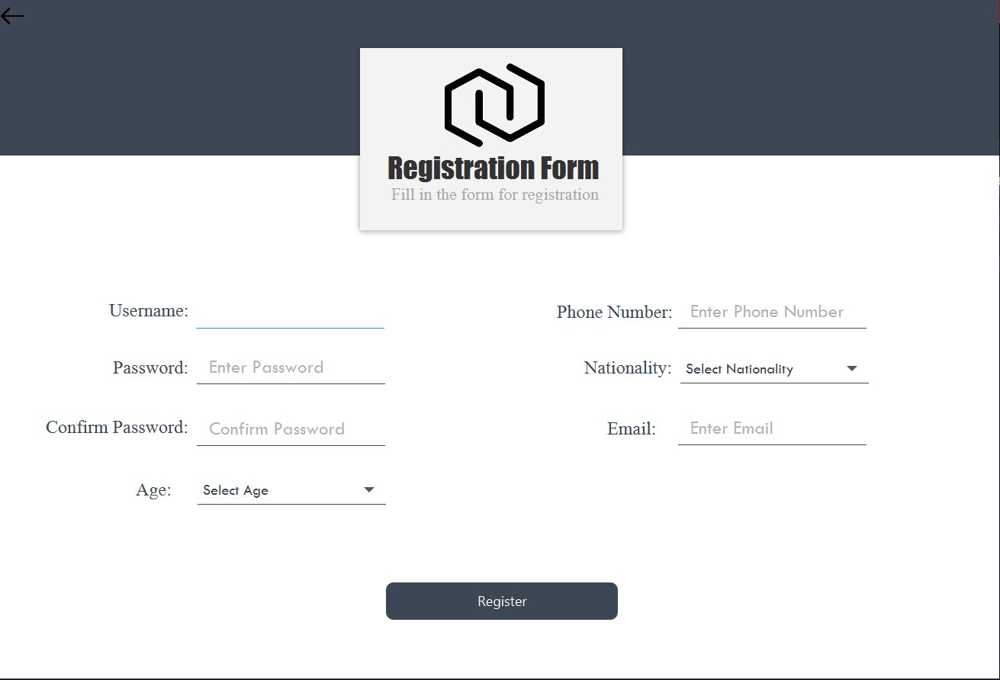
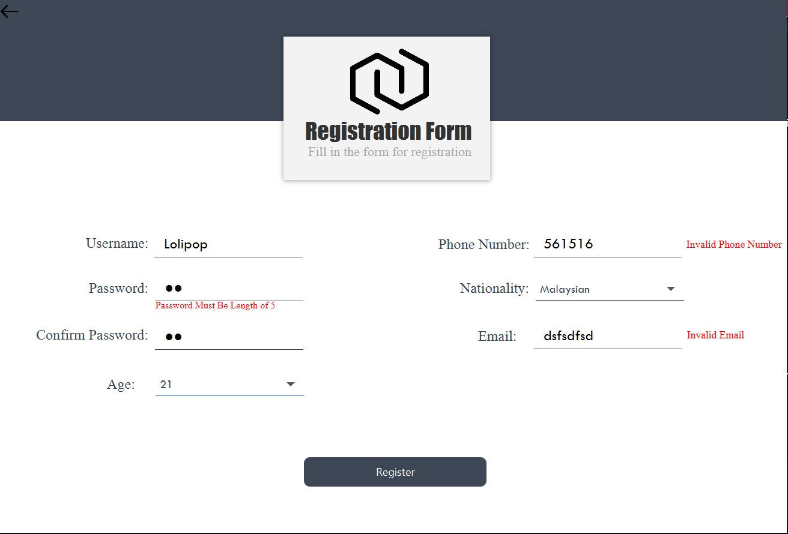
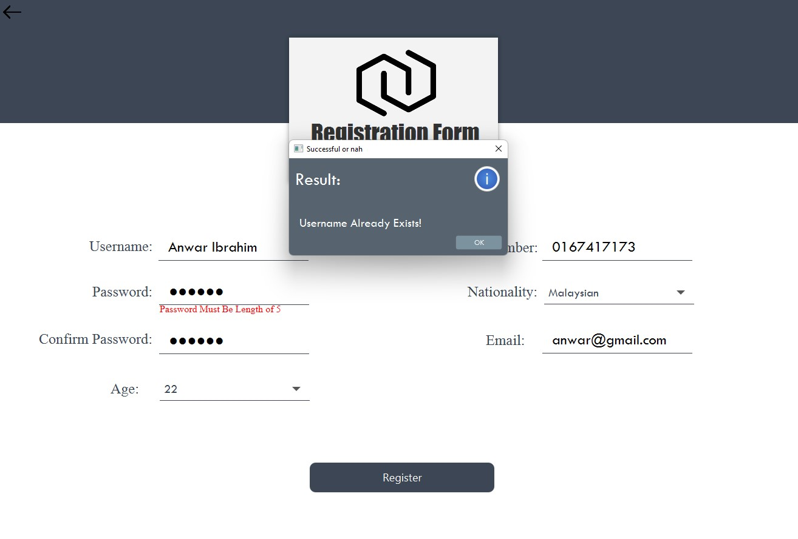

# Trading App
## Login Page
<<<<<<< HEAD
- In the Login Page, users may choose to register themselves by clicking "Sign Up" if they do not have any registered accounts.
- For users who forgot their password, they may click "Forgot Password" to retrieve their password.
- For users with registered accounts, they may sign in using the correct password and username.

### Validation:
- If the username and password are not found in the SQL database, which means the user has input an invalid username or password which are not from registered accounts.
- Or the user trying to log in with empty space in the username input field or password input field or both.
An error would occur:

## Registration Page
- In the Registration Page, personal details should be filled in by users to register an account

### Validation:
- If any of the fields are left empty 
An error would occur:

- Password is set to follow the length of 5
- Phone Number is set to follow the format of Malaysia Phone Number format (Phone numbers starting with 011/015 will have a total of 11 digits,while others will have a total of 10 digits.)
- Email is set to follow the format where "@", ".com" and ".my" should exist.
   
  **If any of this is not followed**
  Errors would occur:
  

- If the input username is already used to register an account
  An error would occur:
  
  

