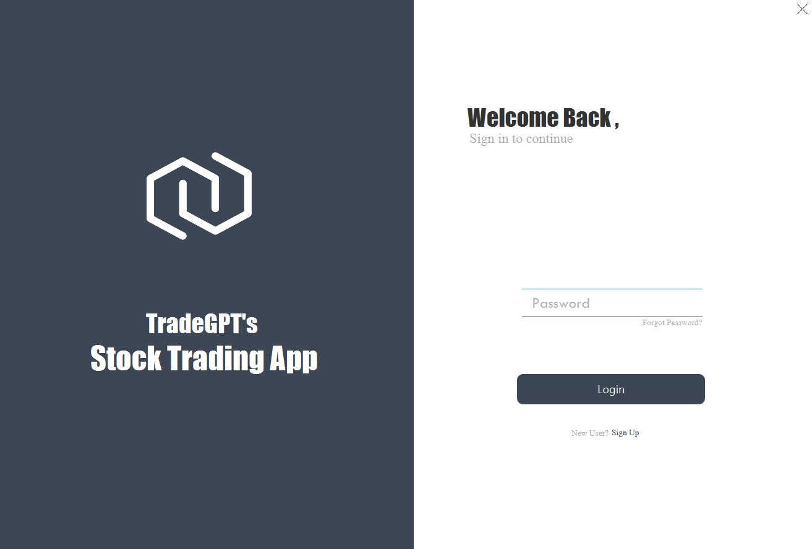
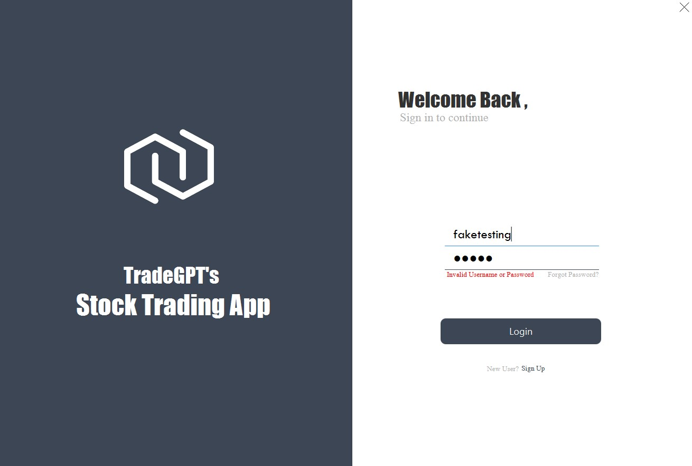

# Trading App
## Login Page
- In the Login Page, users may choose to register themselves by clicking "Sign Up" if they do not have any registered accounts.
- For users who forgot their password, they may click "Forgot Password" to retrieve their password.
- For users with registered accounts, they may sign in using the correct password and username.
 
  
### Validation:
- If the username and password are not found in the SQL database, which means the user has input an invalid username or password which are not from registered accounts.
- Or the user trying to log in with empty space in the username input field or password input field or both.
An error would occur:

## Registration Page
- In the Registration Page, personal details should be filled in by users to register an account

