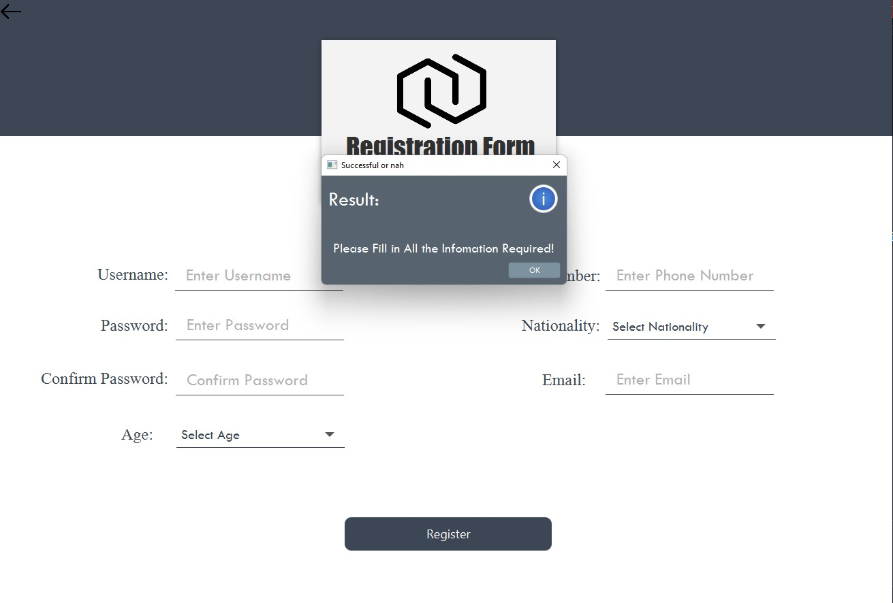

# Trading App
## Login Page
- In the Login Page, users may choose to register themselves by clicking "Sign Up" if they do not have any registered accounts.
- For users who forgot their password, they may click "Forgot Password" to retrieve their password.
- For users with registered accounts, they may sign in using the correct password and username.

### Validation:
- If the username and password are not found in the SQL database, which means the user has input an invalid username or password which are not from registered accounts.
- Or the user trying to log in with empty space in the username input field or password input field or both.
An error would occur:

## Registration Page
- In the Registration Page, personal details should be filled in by users to register an account

### Validation:
- If any of the fields are left empty 
An error would occur:

- Password is set to follow the length of 5
- Phone Number is set to follow the format of Malaysia Phone Number format (Phone numbers starting with 011/015 will have a total of 11 digits,while others will have a total of 10 digits.)
- Email is set to follow the format where "@", ".com" and ".my" should exist.
   
  **If any of this is not followed**
  Errors would occur:
  
  

- If the input username is already used to register an account
  An error would occur:
  
  
## Forgot Password Page
- User may enter their email used to register the account to retrieve their password.

  

- An email will be sent automatically to the user with the details of their password.

  

### Validation:

- If the email is not found in our database as a registered account.

  

- If the email is invalid

   

## Admin Panel
  - When the username and password entered by the user in [Login Page](#login-page) are the account with the role of "Admin", Administrator are brought to the Admin Panel
  - The default page for Admin Panel is the Contact Information of the Administrator that logged in

   

## User Management
  - Administrators are allowed to delete users or requalify them using user management interface
  - Users' username are required to be entered into the input field to specify which user to delete or requalify.

     

### Validation:
  - If the username is not found in the database.
    An error would occur:

     

## Settings
  - Simple Logout button to return to the [Login Page](#login-page)
    
    

## Trading Dashboard
  - When the username and password entered by the user in [Login Page](#login-page) are the account with the role of "Participant", Participants are brought to the Trading Dashboard.
  - The trading dashboard includes the transaction history, Holdings Table that keeps track of the number of lot of stock a participant has and Pending Orders that keep track of the number of orders that the participant put and is yet to be bought or sold.
  - The latest balance ,position and points of the participants are shown at the top of the trading dashboard

     

## Trading
  - Navigate to the trading platform by clicking on Trading on the side panel

      

  - Type in the name of the company, or just the alphabets to get the prompt

      
      
  - The details of the Company Stock will be listed in the middle with a bit of animation(Transition).
  - Enter the Action(Buy/Sell) ,followed by the price and quantity.

     

  - A prompt will appear to notify the user that the trade is successfully done and an receipt in the form of email is sent

    

     

  - For any successfully bought stock (either from lotpool (max 5 lot per order) or from pending order from other participants), it is updated onto the Holdings Table meaning the participants owns them and can put on sell orders with the action Sell to sell the stocks in higher price to make a profit.
  - If there is no matching sell order or lotpool arent enough to supply , a buy order will be created and put on the Pending Order Table.
  - Any of the action(Buy/Sell) will generate a transaction history.
  - Transaction History has 3 status:
    - Buy - Successfully bought 
    - Sell - Successfully sold 
    - Pending - Pending orders (buy order/sell order) are made and yet to be bought or sold
  - Cancel order can be clicked to cancel order with the highest amount of money
## Validation:
  - Invalid Company Name is entered

     

  - As you can see above when the company stock is not found ,the submit order is disabled.
  
  - When wrong type is input to the fields, an error occurs
    
      

  - The Input price is set to follow the rules within 1% of the market price, if the input price is outside of the range, an error occurs

      

  - The Input quantity is set to follow the logic rules > 0 (but < the balance(meaning having enough money to buy) or < the quantity of stock that the participant hold and trying to sell) or else an error occurs

     

## Leaderboard
  - Leaderboard shows the top 10 list of participants with the highest score.
  - The top 3 will be featured on the bottom with their respective trophy and a little animation(transition)

## News Feed
  - News Feed page will share the recent 3 news about trading with their topic , description, published time, and "see more" which will bring the user to the website of the news.

    

     
     
## Profile Information
  - Shows the information that the user used to register the account with a sign out button to return to [Login Page](#login-page)

     

## Help & Support
  - Shows the information of our company, tips and tricks on trading shared by experienced traders and FAQ with our support team.
  - Generate a report on the participant's performance.

    

    
